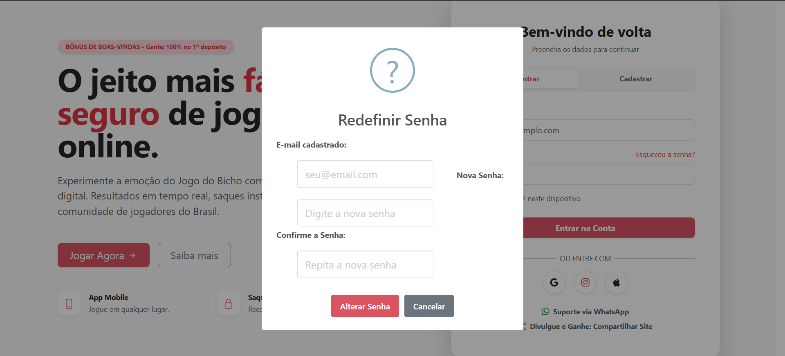
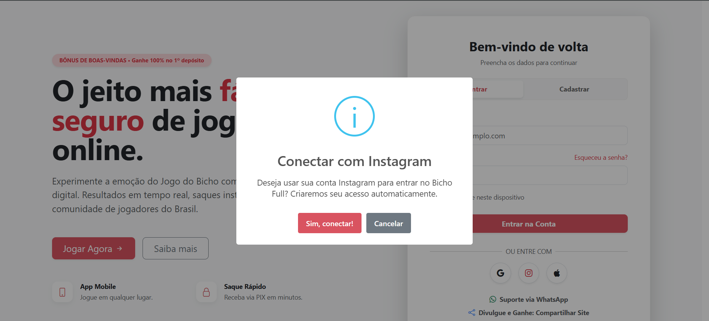
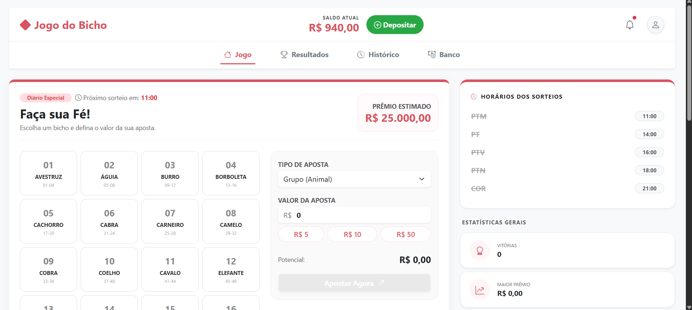
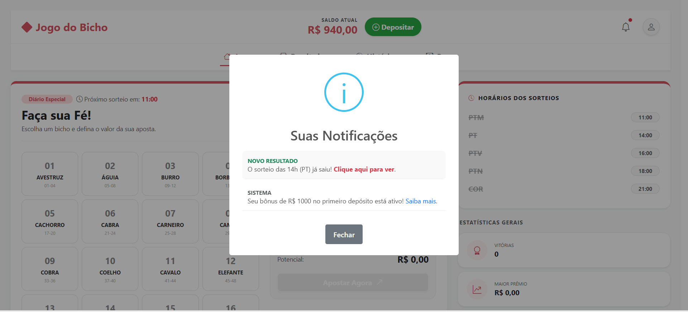
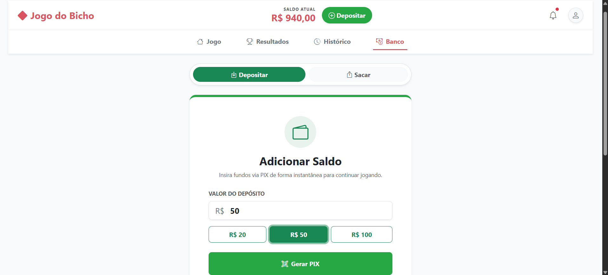
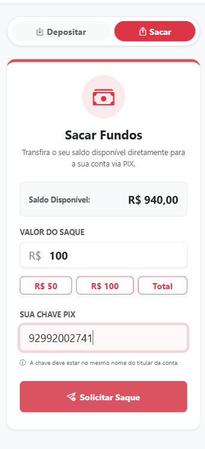
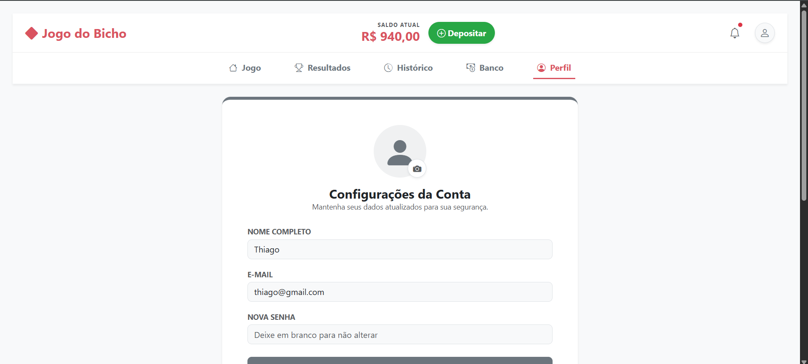
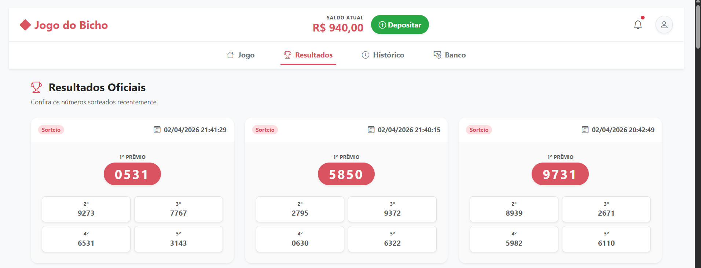
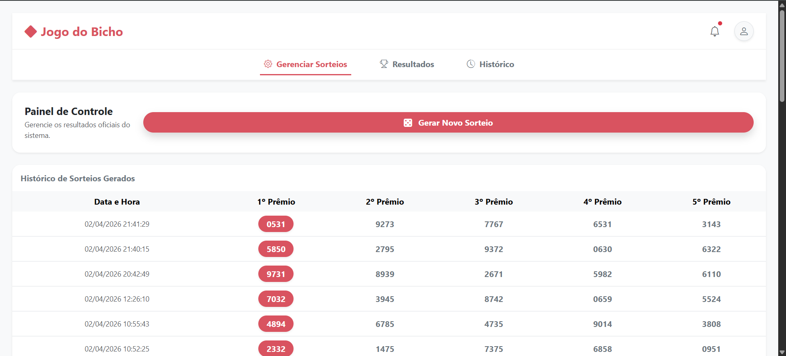
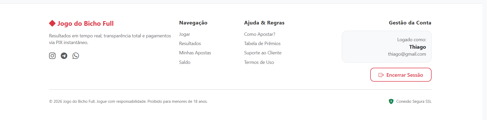

# 🎲 BichoFull - Simulador Full Stack do Jogo do Bicho

O **BichoFull** é uma plataforma completa e responsiva para gestão de apostas e simulação da dinâmica do Jogo do Bicho. Este projeto foi desenvolvido para a disciplina de **Laboratório de Engenharia de Software (6º Período)**, integrando regras de negócio complexas, segurança com JWT e um pipeline de Integração Contínua (CI/CD).

---

## 🚀 Status do Projeto: [](https://github.com/Taynarabr/bichofull/actions)

O selo acima garante que a versão atual do código passou por:
1. **Build Check:** Compilação bem-sucedida de Frontend e Backend.
2. **Linter:** Verificação de padrões de código Angular.
3. **Testes Unitários:** Execução automatizada via Vitest/Playwright no GitHub Actions.

---

## ✨ Funcionalidades Principais

### 👤 Área do Jogador
* **Autenticação Segura:** Cadastro e Login protegidos por tokens JWT e criptografia BCrypt.
* **Sistema de Apostas:** Suporte oficial para **Grupo (18x)**, **Dezena** e **Milhar (4000x)**.
* **Gestão Financeira:** Saldo fictício inicial de **R$ 1.000,00**, com interface para simulação de depósitos via Pix e saques validados.
* **Dashboard Real-Time:** Atualização automática de sorteios e saldo via Polling (sem necessidade de F5).

### ⚙️ Área do Administrador (Admin)
* **Motor de Sorteio:** Interface para geração de resultados oficiais (1º ao 5º prêmio).
* **Auditoria de Resultados:** Listagem completa de todos os sorteios realizados no sistema.

---

## 📸 Telas do Sistema

### 1. Acesso e Login
<div align="center">
  
  <p><i>Ponto de partida: Login, Cadastro e Boas-vindas.</i></p>
</div>

| Pop-up: Recuperar Senha | Pop-up: Conexão Social |
| :---: | :---: |
|  |  |
| *Fluxo para redefinição de senha segura.* | *Alternativa rápida para conexão.* |

<br>

### 2. O Dashboard do Jogador
<div align="center">
  
  <p><i>O coração do jogo: Painel do Jogador, Estatísticas e Sorteios Atuais.</i></p>
</div>

<div align="center">
  
  <p><i>Alertas de novos resultados do sistema em tempo real.</i></p>
</div>

<br>

### 3. Gerenciamento Financeiro
<div align="center">
  
  
  <p><i>Adicionar Saldo (Depósito por Pix) vs. Sacar Fundos (Saque via Pix).</i></p>
</div>

<br>

### 4. Gestão e Resultados
<div align="center">
  
  
  <p><i>Configurações de Perfil do usuário vs. Histórico de Resultados Oficiais.</i></p>
</div>

<br>

### 5. Área do Administrador (Admin)
<div align="center">
  
  <p><i>Painel de Controle exclusivo para geração de novos sorteios e auditoria.</i></p>
</div>

<br>

### 6. Rodapé
<div align="center">
  
  <p><i>Links de Navegação, Suporte e Opção de Logout.</i></p>
</div>

---

## 🛠️ Tecnologias Utilizadas

* **Frontend:** Angular 17+, TypeScript, Bootstrap 5, RxJS, SweetAlert2 e Vitest.
* **Backend:** Java 21, Spring Boot 3, Spring Security, Spring Data JPA e Hibernate.
* **Banco de Dados:** MySQL / MariaDB.
* **Infraestrutura:** GitHub Actions para CI/CD e GitHub Projects (Kanban).

---

## 🔐 Acesso para Testes (Homologação)

Para facilitar a avaliação imediata sem necessidade de novos cadastros, utilize as contas abaixo:

| Perfil | E-mail | Senha |
| :--- | :--- | :--- |
| **Administrador** | admin@bichofull.com | 123456 |
| **Jogador Teste** | user@bichofull.com | user123 | 
*(Ou crie um novo usuário diretamente no sistema)*
*O projeto já inclui um dump completo do banco: [script_banco.sql](./bichofull_backup.sql). Basta importá-lo para ter acesso imediato aos 25 animais cadastrados e usuários de homologação.*

---

## 🚀 Como Executar o Projeto na sua Máquina

### 📋 Pré-requisitos
* **Java JDK 21** instalado.
* **Node.js** (v20+) e **NPM** instalados.
* **Maven** instalado.
* **MySQL** rodando na porta 3306.

### 1. Preparação do Banco de Dados
No seu terminal MySQL, crie o esquema necessário:

CREATE DATABASE bichofull;

### 2. Execução do Backend (Spring Boot)
* **Acesse o arquivo backend/src/main/resources/application.properties e configure seu usuário e senha do MySQL.

* **No terminal, execute:

cd backend
mvn clean install
mvn spring-boot:run

* **API: http://localhost:8080
* **Swagger: http://localhost:8080/swagger-ui/index.html

### 3. Execução do Frontend (Angular)
Em um novo terminal, execute:

cd frontend
npm install
npm start
URL: Acesse http://localhost:4200

### 📌 Gestão do Projeto
O desenvolvimento foi orquestrado via GitHub Projects seguindo o fluxo Kanban:

* **Backlog: Novas ideias e requisitos.

* **To Do: Tarefas priorizadas para a sprint.

* **In Progress: Atividades em execução.

* **Review/QA: Validação de código e testes de integração.

* **Done: Funcionalidades integradas com sucesso e validadas pelo CI.

##Desenvolvido por: Taynara Batista Ribeiro
Engenharia de Software - 6º Período
```sql
